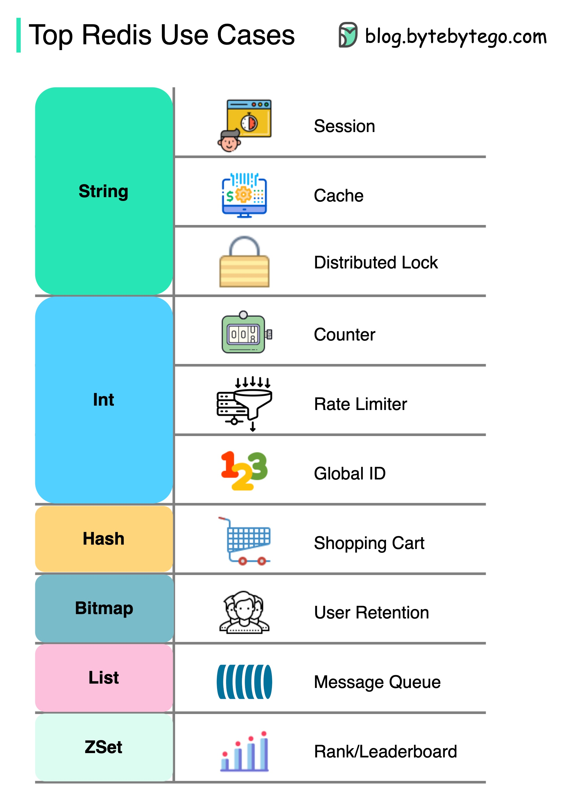
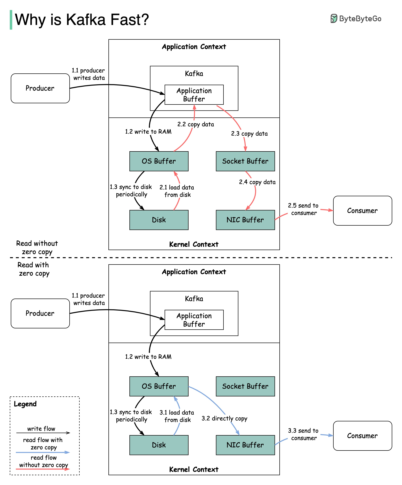
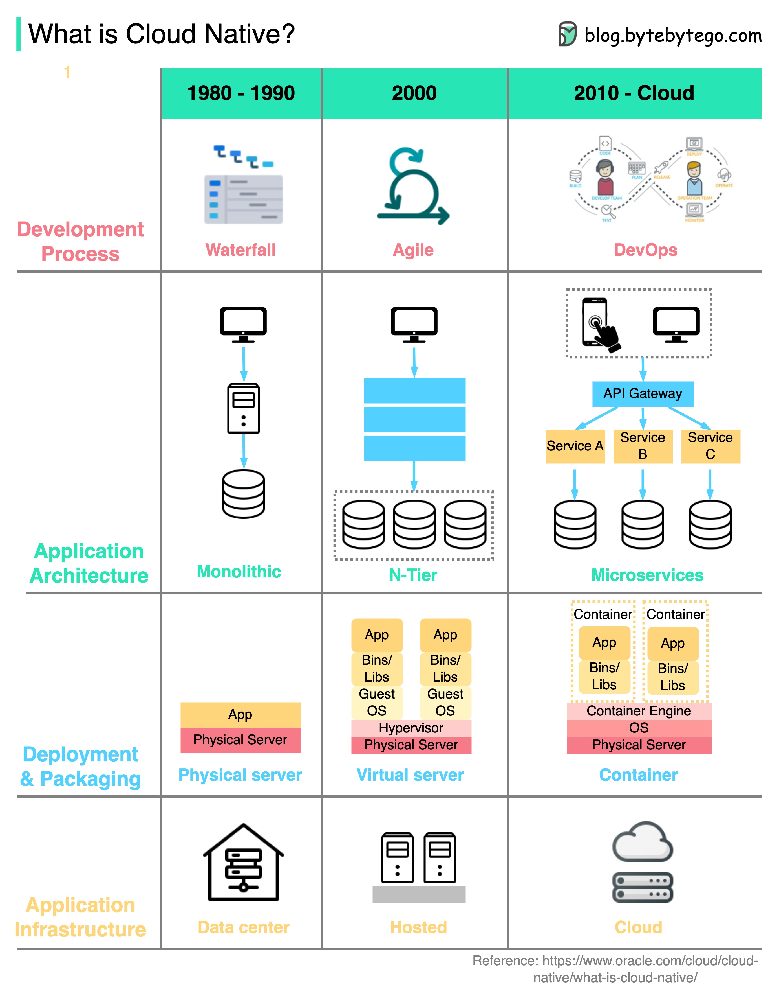

# Thiết Kế Hệ Thống 101

Giải thích các hệ thống phức tạp bằng hình ảnh trực quan và các thuật ngữ đơn giản.

Cho dù bạn đang chuẩn bị cho một cuộc phỏng vấn Thiết kế Hệ thống hay đơn giản là muốn hiểu cách các hệ thống hoạt động bên dưới bề mặt, chúng tôi hy vọng kho lưu trữ này sẽ giúp bạn đạt được điều đó.

## Bộ nhớ đệm

### Dữ liệu được lưu vào bộ nhớ đệm ở mọi nơi

Sơ đồ này minh họa nơi chúng ta lưu trữ dữ liệu trong bộ nhớ đệm trong một kiến trúc điển hình.

  

Có **nhiều lớp** dọc theo luồng.

1. Ứng dụng client: Các phản hồi HTTP có thể được lưu trong bộ nhớ đệm của trình duyệt. Chúng ta yêu cầu dữ liệu qua HTTP lần đầu tiên, và nó được trả về với chính sách hết hạn trong header HTTP; chúng ta yêu cầu dữ liệu lại, và ứng dụng client cố gắng truy xuất dữ liệu từ bộ nhớ đệm trình duyệt trước.

2. CDN: CDN lưu trữ các tài nguyên web tĩnh. Các client có thể truy xuất dữ liệu từ một node CDN gần đó.

3. Load Balancer: Load Balancer cũng có thể lưu trữ tài nguyên.

4. Cơ sở hạ tầng nhắn tin: Message broker lưu trữ tin nhắn trên đĩa trước, sau đó người tiêu dùng truy xuất chúng theo tốc độ của riêng họ. Tùy thuộc vào chính sách lưu giữ, dữ liệu được lưu trong cụm Kafka trong một khoảng thời gian.

5. Dịch vụ: Có nhiều lớp bộ nhớ đệm trong một dịch vụ. Nếu dữ liệu không được lưu trong bộ nhớ đệm CPU, dịch vụ sẽ cố gắng truy xuất dữ liệu từ bộ nhớ. Đôi khi dịch vụ có bộ nhớ đệm cấp hai để lưu trữ dữ liệu trên đĩa.

6. Bộ nhớ đệm phân tán: Bộ nhớ đệm phân tán như Redis giữ các cặp khóa-giá trị cho nhiều dịch vụ trong bộ nhớ. Nó cung cấp hiệu suất đọc/ghi tốt hơn nhiều so với cơ sở dữ liệu.

7. Tìm kiếm toàn văn bản: đôi khi chúng ta cần sử dụng tìm kiếm toàn văn bản như Elastic Search để tìm kiếm tài liệu hoặc tìm kiếm nhật ký. Một bản sao của dữ liệu được lập chỉ mục trong công cụ tìm kiếm.

8. Cơ sở dữ liệu: Ngay cả trong cơ sở dữ liệu, chúng ta có các cấp độ bộ nhớ đệm khác nhau:
- WAL (Write-ahead Log): dữ liệu được ghi vào WAL trước khi xây dựng chỉ mục B-tree
- Bufferpool: Một vùng bộ nhớ được phân bổ để lưu trữ kết quả truy vấn
- Materialized View: Tính toán trước kết quả truy vấn và lưu trữ chúng trong các bảng cơ sở dữ liệu để có hiệu suất truy vấn tốt hơn
- Transaction log: ghi lại tất cả các giao dịch và cập nhật cơ sở dữ liệu
- Replication Log: được sử dụng để ghi lại trạng thái sao chép trong cụm cơ sở dữ liệu

### Tại sao Redis lại nhanh?

Có 3 lý do chính như được hiển thị trong sơ đồ dưới đây.

  

1. Redis là một kho dữ liệu dựa trên RAM. Truy cập RAM nhanh hơn ít nhất 1000 lần so với truy cập đĩa ngẫu nhiên.
2. Redis tận dụng IO multiplexing và vòng lặp thực thi đơn luồng để hiệu quả thực thi.
3. Redis tận dụng một số cấu trúc dữ liệu cấp thấp hiệu quả.

Câu hỏi: Một kho lưu trữ trong bộ nhớ phổ biến khác là Memcached. Bạn có biết sự khác biệt giữa Redis và Memcached không?

Bạn có thể đã nhận thấy phong cách của sơ đồ này khác với các bài đăng trước đây của tôi. Vui lòng cho tôi biết bạn thích cái nào hơn.

### Redis có thể được sử dụng như thế nào?

  

Redis không chỉ dùng để lưu trữ đệm.

Redis có thể được sử dụng trong nhiều kịch bản như được hiển thị trong sơ đồ.

- Session

  Chúng ta có thể sử dụng Redis để chia sẻ dữ liệu phiên người dùng giữa các dịch vụ khác nhau.

- Cache

  Chúng ta có thể sử dụng Redis để lưu trữ đệm các đối tượng hoặc trang, đặc biệt là cho dữ liệu điểm nóng.

- Distributed lock

  Chúng ta có thể sử dụng một chuỗi Redis để có được khóa giữa các dịch vụ phân tán.

- Counter

  Chúng ta có thể đếm số lượt thích hoặc số lượt đọc cho các bài viết.

- Rate limiter

  Chúng ta có thể áp dụng bộ giới hạn tốc độ cho một số IP người dùng nhất định.

- Global ID generator

  Chúng ta có thể sử dụng Redis Int cho ID toàn cục.

- Shopping cart

  Chúng ta có thể sử dụng Redis Hash để đại diện cho các cặp khóa-giá trị trong giỏ hàng.

- Calculate user retention

  Chúng ta có thể sử dụng Bitmap để đại diện cho việc đăng nhập hàng ngày của người dùng và tính toán mức độ giữ chân người dùng.

- Message queue

  Chúng ta có thể sử dụng List cho hàng đợi tin nhắn.

- Ranking

  Chúng ta có thể sử dụng ZSet để sắp xếp các bài viết.

### Các chiến lược lưu trữ đệm hàng đầu

Thiết kế các hệ thống quy mô lớn thường đòi hỏi xem xét cẩn thận về lưu trữ đệm.
Dưới đây là năm chiến lược lưu trữ đệm thường được sử dụng.

  

## Kiến trúc vi dịch vụ

### Một kiến trúc vi dịch vụ điển hình trông như thế nào?

  

Sơ đồ dưới đây cho thấy một kiến trúc vi dịch vụ điển hình.

- Load Balancer: Phân phối lưu lượng đến đến nhiều dịch vụ backend.
- CDN (Content Delivery Network): CDN là một nhóm các máy chủ được phân bố địa lý giữ nội dung tĩnh để phân phối nhanh hơn. Các client tìm kiếm nội dung trong CDN trước, sau đó tiến đến các dịch vụ backend.
- API Gateway: Xử lý các yêu cầu đến và định tuyến chúng đến các dịch vụ liên quan. Nó nói chuyện với nhà cung cấp danh tính và service discovery.
- Identity Provider: Xử lý xác thực và ủy quyền cho người dùng.
- Service Registry & Discovery: Đăng ký và khám phá vi dịch vụ xảy ra trong thành phần này, và API gateway tìm kiếm các dịch vụ liên quan trong thành phần này để nói chuyện.
- Management: Thành phần này chịu trách nhiệm giám sát các dịch vụ.
- Microservices: Các vi dịch vụ được thiết kế và triển khai trong các miền khác nhau. Mỗi miền có cơ sở dữ liệu riêng. API gateway nói chuyện với các vi dịch vụ thông qua REST API hoặc các giao thức khác, và các vi dịch vụ trong cùng một miền nói chuyện với nhau bằng RPC (Remote Procedure Call).

Lợi ích của vi dịch vụ:

- Chúng có thể được thiết kế, triển khai và mở rộng theo chiều ngang nhanh chóng.
- Mỗi miền có thể được duy trì độc lập bởi một nhóm chuyên dụng.
- Các yêu cầu kinh doanh có thể được tùy chỉnh trong từng miền và được hỗ trợ tốt hơn, do đó.

### Các phương pháp hay nhất về vi dịch vụ

Một hình ảnh đáng giá ngàn lời nói: 9 phương pháp hay nhất để phát triển vi dịch vụ.

  

Khi chúng ta phát triển vi dịch vụ, chúng ta cần tuân theo các phương pháp hay nhất sau:

1. Sử dụng lưu trữ dữ liệu riêng biệt cho mỗi vi dịch vụ
2. Giữ mã ở mức độ trưởng thành tương tự
3. Xây dựng riêng biệt cho mỗi vi dịch vụ
4. Gán cho mỗi vi dịch vụ một trách nhiệm duy nhất
5. Triển khai vào containers
6. Thiết kế dịch vụ không trạng thái
7. Áp dụng thiết kế hướng miền
8. Thiết kế micro frontend
9. Điều phối vi dịch vụ

### Tech stack nào thường được sử dụng cho vi dịch vụ?

Dưới đây bạn sẽ thấy một sơ đồ cho thấy tech stack vi dịch vụ, cả cho giai đoạn phát triển và cho production.

  

▶️ Pre-Production

- Định nghĩa API - Điều này thiết lập một hợp đồng giữa frontend và backend. Chúng ta có thể sử dụng Postman hoặc OpenAPI cho việc này.
- Phát triển - Node.js hoặc react phổ biến cho phát triển frontend, và java/python/go cho phát triển backend. Ngoài ra, chúng ta cần thay đổi cấu hình trong API gateway theo định nghĩa API.
- Tích hợp liên tục - JUnit và Jenkins cho kiểm thử tự động. Mã được đóng gói thành một Docker image và triển khai dưới dạng vi dịch vụ.

▶️ Production

- NGinx là một lựa chọn phổ biến cho load balancers. Cloudflare cung cấp CDN (Content Delivery Network).
- API Gateway - Chúng ta có thể sử dụng spring boot cho gateway, và sử dụng Eureka/Zookeeper cho service discovery.
- Các vi dịch vụ được triển khai trên đám mây. Chúng ta có các lựa chọn giữa AWS, Microsoft Azure, hoặc Google GCP.
Cache và Full-text Search - Redis là một lựa chọn phổ biến để lưu trữ đệm các cặp khóa-giá trị. Elasticsearch được sử dụng cho tìm kiếm toàn văn bản.
- Giao tiếp - Để các dịch vụ nói chuyện với nhau, chúng ta có thể sử dụng cơ sở hạ tầng nhắn tin Kafka hoặc RPC.
- Persistence - Chúng ta có thể sử dụng MySQL hoặc PostgreSQL cho cơ sở dữ liệu quan hệ, và Amazon S3 cho lưu trữ đối tượng. Chúng ta cũng có thể sử dụng Cassandra cho cửa hàng cột rộng nếu cần thiết.
- Quản lý & Giám sát - Để quản lý rất nhiều vi dịch vụ, các công cụ Ops phổ biến bao gồm Prometheus, Elastic Stack và Kubernetes.

### Tại sao Kafka lại nhanh

Có nhiều quyết định thiết kế đã góp phần vào hiệu suất của Kafka. Trong bài đăng này, chúng ta sẽ tập trung vào hai điều. Chúng tôi nghĩ hai điều này mang lại trọng lượng lớn nhất.

  

1. Điều đầu tiên là sự phụ thuộc của Kafka vào I/O Tuần tự.
2. Lựa chọn thiết kế thứ hai mang lại lợi thế hiệu suất cho Kafka là tập trung vào hiệu quả: nguyên tắc zero copy.

Sơ đồ minh họa cách dữ liệu được truyền giữa producer và consumer, và zero-copy nghĩa là gì.

- Bước 1.1 - 1.3: Producer ghi dữ liệu vào đĩa
- Bước 2: Consumer đọc dữ liệu không có zero-copy

2.1 Dữ liệu được tải từ đĩa vào bộ nhớ đệm OS

2.2 Dữ liệu được sao chép từ bộ nhớ đệm OS vào ứng dụng Kafka

2.3 Ứng dụng Kafka sao chép dữ liệu vào bộ đệm socket

2.4 Dữ liệu được sao chép từ bộ đệm socket vào card mạng

2.5 Card mạng gửi dữ liệu ra ngoài đến consumer

- Bước 3: Consumer đọc dữ liệu với zero-copy

3.1: Dữ liệu được tải từ đĩa vào bộ nhớ đệm OS
3.2 Bộ nhớ đệm OS trực tiếp sao chép dữ liệu vào card mạng thông qua lệnh sendfile()
3.3 Card mạng gửi dữ liệu ra ngoài đến consumer

Zero copy là một lối tắt để tiết kiệm việc sao chép dữ liệu nhiều lần giữa ngữ cảnh ứng dụng và ngữ cảnh kernel. 

## Hệ thống thanh toán

### Làm thế nào để tìm hiểu về hệ thống thanh toán?

  

### Tại sao thẻ tín dụng được gọi là "sản phẩm sinh lời nhất trong ngân hàng"? VISA/Mastercard kiếm tiền như thế nào?

Sơ đồ dưới đây cho thấy kinh tế học của luồng thanh toán thẻ tín dụng.

  

1. Chủ thẻ trả cho người bán 100$ để mua một sản phẩm.

2. Người bán được hưởng lợi từ việc sử dụng thẻ tín dụng với doanh số bán hàng cao hơn và cần bồi thường cho tổ chức phát hành và mạng lưới thẻ vì đã cung cấp dịch vụ thanh toán. Ngân hàng chấp nhận thanh toán thiết lập một khoản phí với người bán, được gọi là "phí chiết khấu người bán."

3 - 4. Ngân hàng chấp nhận thanh toán giữ lại 0,25$ làm phí chấp nhận thanh toán, và 1,75$ được trả cho ngân hàng phát hành dưới dạng phí interchange. Phí chiết khấu người bán phải bao gồm phí interchange.

Phí interchange được thiết lập bởi mạng lưới thẻ vì việc mỗi ngân hàng phát hành thương lượng phí với từng người bán là không hiệu quả.

5. Mạng lưới thẻ thiết lập các đánh giá và phí mạng lưới với mỗi ngân hàng, ngân hàng trả cho mạng lưới thẻ cho các dịch vụ của họ hàng tháng. Ví dụ, VISA tính phí đánh giá 0,11%, cộng với phí sử dụng 0,0195$, cho mỗi lần quẹt thẻ.

6. Chủ thẻ trả cho ngân hàng phát hành cho các dịch vụ của họ.

Tại sao ngân hàng phát hành nên được bồi thường?

- Tổ chức phát hành trả tiền cho người bán ngay cả khi chủ thẻ không trả được cho tổ chức phát hành.
- Tổ chức phát hành trả tiền cho người bán trước khi chủ thẻ trả cho tổ chức phát hành.
- Tổ chức phát hành có các chi phí hoạt động khác, bao gồm quản lý tài khoản khách hàng, cung cấp bảng sao kê, phát hiện gian lận, quản lý rủi ro, thanh toán & quyết toán, v.v.

### VISA hoạt động như thế nào khi chúng ta quẹt thẻ tín dụng tại cửa hàng?

  

VISA, Mastercard và American Express hoạt động như các mạng lưới thẻ để thanh toán và quyết toán tiền. Ngân hàng chấp nhận thanh toán và ngân hàng phát hành thẻ có thể - và thường là - khác nhau. Nếu các ngân hàng phải quyết toán giao dịch từng cái một mà không có trung gian, mỗi ngân hàng sẽ phải quyết toán các giao dịch với tất cả các ngân hàng khác. Điều này khá không hiệu quả.

Sơ đồ dưới đây cho thấy vai trò của VISA trong quy trình thanh toán thẻ tín dụng. Có hai luồng liên quan. Luồng ủy quyền xảy ra khi khách hàng quẹt thẻ tín dụng. Luồng ghi nhận và quyết toán xảy ra khi người bán muốn nhận tiền vào cuối ngày.

- Luồng ủy quyền

Bước 0: Ngân hàng phát hành thẻ phát hành thẻ tín dụng cho khách hàng của họ.

Bước 1: Chủ thẻ muốn mua một sản phẩm và quẹt thẻ tín dụng tại thiết bị đầu cuối Điểm bán hàng (POS) trong cửa hàng của người bán.

Bước 2: Thiết bị đầu cuối POS gửi giao dịch đến ngân hàng chấp nhận thanh toán, ngân hàng đã cung cấp thiết bị đầu cuối POS.

Bước 3 và 4: Ngân hàng chấp nhận thanh toán gửi giao dịch đến mạng lưới thẻ, còn được gọi là sơ đồ thẻ. Mạng lưới thẻ gửi giao dịch đến ngân hàng phát hành để phê duyệt.

Bước 4.1, 4.2 và 4.3: Ngân hàng phát hành đóng băng tiền nếu giao dịch được phê duyệt. Việc phê duyệt hoặc từ chối được gửi lại cho ngân hàng chấp nhận thanh toán, cũng như thiết bị đầu cuối POS.

- Luồng ghi nhận và quyết toán

Bước 1 và 2: Người bán muốn thu tiền vào cuối ngày, vì vậy họ nhấn "ghi nhận" trên thiết bị đầu cuối POS. Các giao dịch được gửi đến ngân hàng chấp nhận thanh toán theo lô. Ngân hàng chấp nhận thanh toán gửi tệp lô với các giao dịch đến mạng lưới thẻ.

Bước 3: Mạng lưới thẻ thực hiện thanh toán cho các giao dịch được thu thập từ các ngân hàng chấp nhận thanh toán khác nhau, và gửi các tệp thanh toán đến các ngân hàng phát hành khác nhau.

Bước 4: Các ngân hàng phát hành xác nhận tính chính xác của các tệp thanh toán, và chuyển tiền đến các ngân hàng chấp nhận thanh toán liên quan.

Bước 5: Ngân hàng chấp nhận thanh toán sau đó chuyển tiền đến ngân hàng của người bán.

Bước 4: Mạng lưới thẻ thanh toán các giao dịch từ các ngân hàng chấp nhận thanh toán khác nhau. Thanh toán là một quy trình trong đó các giao dịch bù trừ lẫn nhau được cấn trừ, vì vậy số lượng giao dịch tổng thể được giảm xuống.

Trong quy trình này, mạng lưới thẻ gánh vác gánh nặng nói chuyện với mỗi ngân hàng và nhận phí dịch vụ để đổi lại.

### Hệ thống thanh toán trên thế giới (Phần 1): Giao diện thanh toán thống nhất (UPI) ở Ấn Độ

UPI là gì? UPI là một hệ thống thanh toán thời gian thực tức thì được phát triển bởi Tổng công ty thanh toán quốc gia Ấn Độ.

Nó chiếm 60% giao dịch bán lẻ kỹ thuật số ở Ấn Độ ngày nay.

UPI = ngôn ngữ đánh dấu thanh toán + tiêu chuẩn cho thanh toán có thể tương tác

  

 

## DevOps

### DevOps vs. SRE vs. Platform Engineering. Sự khác biệt là gì?

Các khái niệm về DevOps, SRE và Platform Engineering đã xuất hiện vào những thời điểm khác nhau và được phát triển bởi các cá nhân và tổ chức khác nhau.

  

DevOps như một khái niệm được giới thiệu vào năm 2009 bởi Patrick Debois và Andrew Shafer tại hội nghị Agile. Họ tìm cách thu hẹp khoảng cách giữa phát triển phần mềm và vận hành bằng cách thúc đẩy văn hóa hợp tác và chia sẻ trách nhiệm cho toàn bộ vòng đời phát triển phần mềm.

SRE, hay Site Reliability Engineering, được tiên phong bởi Google vào đầu những năm 2000 để giải quyết các thách thức vận hành trong việc quản lý các hệ thống phức tạp, quy mô lớn. Google đã phát triển các thực hành và công cụ SRE, chẳng hạn như hệ thống quản lý cụm Borg và hệ thống giám sát Monarch, để cải thiện độ tin cậy và hiệu quả của các dịch vụ của họ.

Platform Engineering là một khái niệm gần đây hơn, xây dựng trên nền tảng của kỹ thuật SRE. Nguồn gốc chính xác của Platform Engineering không rõ ràng, nhưng nó thường được hiểu là một phần mở rộng của các thực hành DevOps và SRE, với trọng tâm là cung cấp một nền tảng toàn diện cho phát triển sản phẩm hỗ trợ toàn bộ góc nhìn kinh doanh.

Đáng chú ý là mặc dù các khái niệm này xuất hiện vào những thời điểm khác nhau. Chúng đều liên quan đến xu hướng rộng lớn hơn về cải thiện sự hợp tác, tự động hóa và hiệu quả trong phát triển và vận hành phần mềm.

### k8s (Kubernetes) là gì?

K8s là một hệ thống điều phối container. Nó được sử dụng để triển khai và quản lý container. Thiết kế của nó chịu ảnh hưởng lớn từ hệ thống nội bộ Borg của Google.

  

Một cụm k8s bao gồm một tập hợp các máy worker, được gọi là các node, chạy các ứng dụng được containerized. Mọi cụm có ít nhất một worker node.

(Các) worker node lưu trữ các Pod là các thành phần của workload ứng dụng. Control plane quản lý các worker node và các Pod trong cụm. Trong môi trường production, control plane thường chạy trên nhiều máy tính, và một cụm thường chạy nhiều node, cung cấp khả năng chịu lỗi và tính sẵn sàng cao.

- Các thành phần Control Plane

1. API Server

    API server nói chuyện với tất cả các thành phần trong cụm k8s. Tất cả các thao tác trên pod được thực hiện bằng cách nói chuyện với API server.

2. Scheduler

    Scheduler theo dõi workload pod và gán tải cho các pod mới tạo.

3. Controller Manager

    Controller manager chạy các controller, bao gồm Node Controller, Job Controller, EndpointSlice Controller và ServiceAccount Controller.

4. Etcd
    
    etcd là một kho lưu trữ key-value được sử dụng làm kho lưu trữ sao lưu cho tất cả dữ liệu cụm.

- Nodes

1. Pods

    Pod là một nhóm container và là đơn vị nhỏ nhất mà k8s quản lý. Pod có một địa chỉ IP duy nhất áp dụng cho mọi container trong pod.

2. Kubelet

    Một agent chạy trên mỗi node trong cụm. Nó đảm bảo các container đang chạy trong một Pod.

3. Kube Proxy

    Kube-proxy là một proxy mạng chạy trên mỗi node trong cụm của bạn. Nó định tuyến lưu lượng đến vào một node từ service. Nó chuyển tiếp yêu cầu công việc đến các container chính xác.

### Docker vs. Kubernetes. Chúng ta nên sử dụng cái nào?

  

Docker là gì?

Docker là một nền tảng mã nguồn mở cho phép bạn đóng gói, phân phối và chạy ứng dụng trong các container cô lập. Nó tập trung vào containerization, cung cấp môi trường nhẹ đóng gói ứng dụng và các phụ thuộc của chúng.

Kubernetes là gì?

Kubernetes, thường được gọi là K8s, là một nền tảng điều phối container mã nguồn mở. Nó cung cấp một framework để tự động hóa việc triển khai, mở rộng và quản lý các ứng dụng được containerized trên một cụm các node.

Chúng khác nhau như thế nào?

Docker: Docker hoạt động ở cấp độ container riêng lẻ trên một host hệ điều hành duy nhất.

Bạn phải quản lý thủ công mỗi host và việc thiết lập mạng, chính sách bảo mật và lưu trữ cho nhiều container liên quan có thể phức tạp.

Kubernetes: Kubernetes hoạt động ở cấp độ cụm. Nó quản lý nhiều ứng dụng được containerized trên nhiều host, cung cấp tự động hóa cho các tác vụ như cân bằng tải, mở rộng và đảm bảo trạng thái mong muốn của ứng dụng.

Tóm lại, Docker tập trung vào containerization và chạy container trên các host riêng lẻ, trong khi Kubernetes chuyên về quản lý và điều phối container ở quy mô lớn trên một cụm các host.

### Docker hoạt động như thế nào?

Sơ đồ dưới đây cho thấy kiến trúc của Docker và cách nó hoạt động khi chúng ta chạy "docker build", "docker pull" và "docker run".

  

Có 3 thành phần trong kiến trúc Docker:

- Docker client

    Docker client nói chuyện với Docker daemon.

- Docker host

    Docker daemon lắng nghe các yêu cầu API Docker và quản lý các đối tượng Docker như images, container, mạng và volumes.

- Docker registry

    Docker registry lưu trữ Docker images. Docker Hub là một registry công khai mà bất kỳ ai cũng có thể sử dụng.

Hãy lấy lệnh "docker run" làm ví dụ.

  1. Docker kéo image từ registry.
  2. Docker tạo một container mới.
  3. Docker cấp phát một hệ thống tệp đọc-ghi cho container.
  4. Docker tạo một giao diện mạng để kết nối container với mạng mặc định.
  5. Docker khởi động container. 

## GIT

### Các lệnh Git hoạt động như thế nào

Để bắt đầu, điều quan trọng là phải xác định nơi mã của chúng ta được lưu trữ. Giả định phổ biến là chỉ có hai vị trí - một trên máy chủ từ xa như Github và một trên máy cục bộ của chúng ta. Tuy nhiên, điều này không hoàn toàn chính xác. Git duy trì ba kho lưu trữ cục bộ trên máy của chúng ta, có nghĩa là mã của chúng ta có thể được tìm thấy ở bốn nơi:

  

- Working directory: nơi chúng ta chỉnh sửa tệp
- Staging area: một vị trí tạm thời nơi các tệp được giữ cho lần commit tiếp theo
- Local repository: chứa mã đã được commit
- Remote repository: máy chủ từ xa lưu trữ mã

Hầu hết các lệnh Git chủ yếu di chuyển tệp giữa bốn vị trí này.

### Git hoạt động như thế nào?

Sơ đồ dưới đây cho thấy quy trình làm việc của Git.

  

Git là một hệ thống kiểm soát phiên bản phân tán.

Mỗi nhà phát triển duy trì một bản sao cục bộ của kho lưu trữ chính và chỉnh sửa và commit vào bản sao cục bộ.

Việc commit rất nhanh vì thao tác không tương tác với kho lưu trữ từ xa.

Nếu kho lưu trữ từ xa bị sập, các tệp có thể được khôi phục từ các kho lưu trữ cục bộ.

### Git merge vs. Git rebase

Sự khác biệt là gì?

  

Khi chúng ta **hợp nhất thay đổi** từ một nhánh Git sang nhánh khác, chúng ta có thể sử dụng 'git merge' hoặc 'git rebase'. Sơ đồ dưới đây cho thấy cách hai lệnh hoạt động.

**Git merge**

Điều này tạo ra một commit mới G' trong nhánh main. G' liên kết lịch sử của cả nhánh main và nhánh feature.

Git merge là **không phá hủy**. Cả nhánh main và nhánh feature đều không bị thay đổi.

**Git rebase**

Git rebase di chuyển lịch sử nhánh feature đến đầu nhánh main. Nó tạo ra các commit mới E', F' và G' cho mỗi commit trong nhánh feature.

Lợi ích của rebase là nó có lịch sử commit **tuyến tính**.

Rebase có thể nguy hiểm nếu "quy tắc vàng của git rebase" không được tuân thủ.

**Quy tắc vàng của Git Rebase**

Không bao giờ sử dụng nó trên các nhánh công khai! 

## Dịch vụ đám mây

### Tổng quan về các dịch vụ đám mây khác nhau (phiên bản 2023)

  

### Cloud native là gì?

Dưới đây là sơ đồ cho thấy sự phát triển của kiến trúc và quy trình kể từ những năm 1980.

  

Các tổ chức có thể xây dựng và chạy các ứng dụng có thể mở rộng trên đám mây công cộng, riêng tư và lai bằng cách sử dụng các công nghệ cloud native.

Điều này có nghĩa là các ứng dụng được thiết kế để tận dụng các tính năng đám mây, vì vậy chúng có khả năng phục hồi khi tải và dễ dàng mở rộng.

Cloud native bao gồm 4 khía cạnh:

1. Quy trình phát triển

    Điều này đã tiến triển từ waterfall đến agile đến DevOps.

2. Kiến trúc ứng dụng

    Kiến trúc đã chuyển từ monolithic sang microservices. Mỗi dịch vụ được thiết kế để nhỏ, thích ứng với tài nguyên hạn chế trong các container đám mây.

3. Triển khai & đóng gói

    Các ứng dụng từng được triển khai trên các máy chủ vật lý. Sau đó khoảng năm 2000, các ứng dụng không nhạy cảm với độ trễ thường được triển khai trên các máy chủ ảo. Với các ứng dụng cloud native, chúng được đóng gói thành docker images và triển khai trong các container.

4. Cơ sở hạ tầng ứng dụng

    Các ứng dụng được triển khai chủ yếu trên cơ sở hạ tầng đám mây thay vì các máy chủ tự host. 

## Bảo mật

### HTTPS hoạt động như thế nào?

Hypertext Transfer Protocol Secure (HTTPS) là một phần mở rộng của Hypertext Transfer Protocol (HTTP.) HTTPS truyền dữ liệu được mã hóa bằng Transport Layer Security (TLS.) Nếu dữ liệu bị chặn trực tuyến, tất cả những gì kẻ tấn công nhận được là mã nhị phân.

  

Dữ liệu được mã hóa và giải mã như thế nào?

Bước 1 - Client (trình duyệt) và server thiết lập kết nối TCP.

Bước 2 - Client gửi "client hello" đến server. Thông điệp chứa một tập hợp các thuật toán mã hóa cần thiết (cipher suites) và phiên bản TLS mới nhất mà nó có thể hỗ trợ. Server phản hồi với "server hello" để trình duyệt biết liệu nó có thể hỗ trợ các thuật toán và phiên bản TLS hay không.

Server sau đó gửi chứng chỉ SSL đến client. Chứng chỉ chứa khóa công khai, tên host, ngày hết hạn, v.v. Client xác thực chứng chỉ.

Bước 3 - Sau khi xác thực chứng chỉ SSL, client tạo một khóa phiên và mã hóa nó bằng khóa công khai. Server nhận khóa phiên được mã hóa và giải mã nó bằng khóa riêng tư.

Bước 4 - Bây giờ cả client và server đều giữ cùng một khóa phiên (mã hóa đối xứng), dữ liệu được mã hóa được truyền trong một kênh hai chiều an toàn.

Tại sao HTTPS chuyển sang mã hóa đối xứng trong quá trình truyền dữ liệu? Có hai lý do chính:

1. Bảo mật: Mã hóa bất đối xứng chỉ đi một chiều. Điều này có nghĩa là nếu server cố gắng gửi dữ liệu được mã hóa trở lại client, bất kỳ ai cũng có thể giải mã dữ liệu bằng khóa công khai.

2. Tài nguyên server: Mã hóa bất đối xứng thêm khá nhiều chi phí toán học. Nó không phù hợp cho việc truyền dữ liệu trong các phiên dài.

### OAuth 2.0 được giải thích bằng thuật ngữ đơn giản

OAuth 2.0 là một framework mạnh mẽ và an toàn cho phép các ứng dụng khác nhau tương tác an toàn với nhau thay mặt cho người dùng mà không cần chia sẻ thông tin đăng nhập nhạy cảm.

  

Các thực thể tham gia vào OAuth là Người dùng, Server và Nhà cung cấp danh tính (IDP).

Token OAuth có thể làm gì?

Khi bạn sử dụng OAuth, bạn nhận được một token OAuth đại diện cho danh tính và quyền của bạn. Token này có thể làm một số việc quan trọng:

Single Sign-On (SSO): Với token OAuth, bạn có thể đăng nhập vào nhiều dịch vụ hoặc ứng dụng chỉ bằng một lần đăng nhập, làm cho cuộc sống dễ dàng và an toàn hơn.

Ủy quyền trên các hệ thống: Token OAuth cho phép bạn chia sẻ ủy quyền hoặc quyền truy cập của mình trên các hệ thống khác nhau, vì vậy bạn không cần phải đăng nhập riêng ở mọi nơi.

Truy cập hồ sơ người dùng: Các ứng dụng với token OAuth có thể truy cập một số phần trong hồ sơ người dùng mà bạn cho phép, nhưng chúng sẽ không thấy mọi thứ.

Hãy nhớ rằng, OAuth 2.0 là tất cả về việc giữ an toàn cho bạn và dữ liệu của bạn trong khi làm cho trải nghiệm trực tuyến của bạn liền mạch và không gặp rắc rối trên các ứng dụng và dịch vụ khác nhau.

### 4 hình thức cơ chế xác thực hàng đầu

  

1. SSH Keys:

    Các khóa mật mã được sử dụng để truy cập an toàn vào các hệ thống và máy chủ từ xa

2. OAuth Tokens:

    Các token cung cấp quyền truy cập hạn chế vào dữ liệu người dùng trên các ứng dụng của bên thứ ba

3. SSL Certificates:

    Chứng chỉ số đảm bảo giao tiếp an toàn và được mã hóa giữa máy chủ và client

4. Credentials:

    Thông tin xác thực người dùng được sử dụng để xác minh và cấp quyền truy cập vào các hệ thống và dịch vụ khác nhau

### Session, cookie, JWT, token, SSO và OAuth 2.0 - chúng là gì?

Các thuật ngữ này đều liên quan đến quản lý danh tính người dùng. Khi bạn đăng nhập vào một trang web, bạn khai báo bạn là ai (nhận dạng). Danh tính của bạn được xác minh (xác thực), và bạn được cấp các quyền cần thiết (ủy quyền). Nhiều giải pháp đã được đề xuất trong quá khứ, và danh sách vẫn tiếp tục phát triển.

  

Từ đơn giản đến phức tạp, đây là hiểu biết của tôi về quản lý danh tính người dùng:

- WWW-Authenticate là phương thức cơ bản nhất. Bạn được trình duyệt yêu cầu tên người dùng và mật khẩu. Do không thể kiểm soát vòng đời đăng nhập, nó hiếm khi được sử dụng ngày nay.

- Kiểm soát tốt hơn về vòng đời đăng nhập là session-cookie. Server duy trì lưu trữ phiên, và trình duyệt giữ ID của phiên. Cookie thường chỉ hoạt động với trình duyệt và không thân thiện với ứng dụng di động.

- Để giải quyết vấn đề tương thích, token có thể được sử dụng. Client gửi token đến server, và server xác thực token. Nhược điểm là token cần được mã hóa và giải mã, điều này có thể tốn thời gian.

- JWT là một cách tiêu chuẩn để đại diện cho token. Thông tin này có thể được xác minh và tin cậy vì nó được ký số. Vì JWT chứa chữ ký, không cần thiết phải lưu thông tin phiên ở phía server.

- Bằng cách sử dụng SSO (đăng nhập một lần), bạn có thể đăng nhập chỉ một lần và đăng nhập vào nhiều trang web. Nó sử dụng CAS (dịch vụ xác thực trung tâm) để duy trì thông tin trên các trang.

- Bằng cách sử dụng OAuth 2.0, bạn có thể ủy quyền cho một trang web truy cập thông tin của bạn trên trang web khác.

### Làm thế nào để lưu trữ mật khẩu an toàn trong cơ sở dữ liệu và xác thực mật khẩu?

  

**Những điều KHÔNG nên làm**

- Lưu trữ mật khẩu dưới dạng văn bản thuần túy không phải là một ý tưởng tốt vì bất kỳ ai có quyền truy cập nội bộ đều có thể thấy chúng.

- Lưu trữ hash mật khẩu trực tiếp là không đủ vì nó dễ bị tấn công tính toán trước, chẳng hạn như bảng cầu vồng.

- Để giảm thiểu các cuộc tấn công tính toán trước, chúng ta thêm muối vào mật khẩu.

**Salt là gì?**

Theo hướng dẫn của OWASP, "salt là một chuỗi duy nhất, được tạo ngẫu nhiên được thêm vào mỗi mật khẩu như một phần của quá trình hashing".

**Làm thế nào để lưu trữ mật khẩu và salt?**

1. kết quả hash là duy nhất cho mỗi mật khẩu.
2. Mật khẩu có thể được lưu trữ trong cơ sở dữ liệu theo định dạng sau: hash(password + salt).

**Làm thế nào để xác thực mật khẩu?**

Để xác thực mật khẩu, nó có thể trải qua quá trình sau:

1. Client nhập mật khẩu.
2. Hệ thống lấy salt tương ứng từ cơ sở dữ liệu.
3. Hệ thống thêm salt vào mật khẩu và hash nó. Gọi giá trị đã hash là H1.
4. Hệ thống so sánh H1 và H2, trong đó H2 là hash được lưu trữ trong cơ sở dữ liệu. Nếu chúng giống nhau, mật khẩu hợp lệ.

### Giải thích JSON Web Token (JWT) cho trẻ 10 tuổi

  

Hãy tưởng tượng bạn có một chiếc hộp đặc biệt gọi là JWT. Bên trong hộp này có ba phần: header, payload và signature.

Header giống như nhãn ở bên ngoài hộp. Nó cho chúng ta biết đây là loại hộp gì và nó được bảo mật như thế nào. Nó thường được viết dưới định dạng gọi là JSON, đó chỉ là một cách để tổ chức thông tin sử dụng dấu ngoặc nhọn { } và dấu hai chấm :.

Payload giống như thông điệp hoặc thông tin thực tế bạn muốn gửi. Nó có thể là tên, tuổi của bạn hoặc bất kỳ dữ liệu nào khác bạn muốn chia sẻ. Nó cũng được viết dưới định dạng JSON, vì vậy nó dễ hiểu và làm việc.

Bây giờ, signature giống như một con dấu đặc biệt mà chỉ người gửi mới biết cách tạo ra. Signature được tạo ra bằng cách sử dụng một mã bí mật, giống như một mật khẩu. Signature này đảm bảo rằng không ai có thể can thiệp vào nội dung của JWT mà người gửi không biết về điều đó.

Khi bạn muốn gửi JWT đến một server, bạn đặt header, payload và signature vào trong hộp. Sau đó bạn gửi nó qua cho server. Server có thể dễ dàng đọc header và payload để hiểu bạn là ai và bạn muốn làm gì.

### Google Authenticator (hoặc các loại xác thực 2 yếu tố khác) hoạt động như thế nào?

Google Authenticator thường được sử dụng để đăng nhập vào tài khoản của chúng ta khi xác thực 2 yếu tố được bật. Làm thế nào nó đảm bảo bảo mật?

Google Authenticator là một authenticator dựa trên phần mềm triển khai dịch vụ xác thực hai bước. Sơ đồ dưới đây cung cấp chi tiết.

  

Có hai giai đoạn liên quan:

- Giai đoạn 1 - Người dùng bật xác thực hai bước của Google.
- Giai đoạn 2 - Người dùng sử dụng authenticator để đăng nhập, v.v.

Hãy xem xét các giai đoạn này.

**Giai đoạn 1**

Bước 1 và 2: Bob mở trang web để bật xác thực hai bước. Frontend yêu cầu một khóa bí mật. Dịch vụ xác thực tạo khóa bí mật cho Bob và lưu trữ nó trong cơ sở dữ liệu.

Bước 3: Dịch vụ xác thực trả về một URI cho frontend. URI được tạo thành từ một key issuer, tên người dùng và khóa bí mật. URI được hiển thị dưới dạng mã QR trên trang web.

Bước 4: Bob sau đó sử dụng Google Authenticator để quét mã QR được tạo. Khóa bí mật được lưu trữ trong authenticator.

**Giai đoạn 2**
Bước 1 và 2: Bob muốn đăng nhập vào một trang web với xác thực hai bước của Google. Để làm điều này, anh ấy cần mật khẩu. Cứ sau 30 giây, Google Authenticator tạo một mật khẩu 6 chữ số bằng thuật toán TOTP (Time-based One Time Password). Bob sử dụng mật khẩu để vào trang web.

Bước 3 và 4: Frontend gửi mật khẩu Bob nhập đến backend để xác thực. Dịch vụ xác thực đọc khóa bí mật từ cơ sở dữ liệu và tạo mật khẩu 6 chữ số bằng cùng thuật toán TOTP như client.

Bước 5: Dịch vụ xác thực so sánh hai mật khẩu được tạo bởi client và server, và trả về kết quả so sánh cho frontend. Bob chỉ có thể tiếp tục quá trình đăng nhập nếu hai mật khẩu khớp nhau.

Cơ chế xác thực này có an toàn không?

- Khóa bí mật có thể bị người khác lấy được không?

    Chúng ta cần đảm bảo khóa bí mật được truyền bằng HTTPS. Client authenticator và cơ sở dữ liệu lưu trữ khóa bí mật, và chúng ta cần đảm bảo các khóa bí mật được mã hóa.

- Mật khẩu 6 chữ số có thể bị hacker đoán được không?
    
    Không. Mật khẩu có 6 chữ số, vì vậy mật khẩu được tạo có 1 triệu tổ hợp tiềm năng. Thêm vào đó, mật khẩu thay đổi sau mỗi 30 giây. Nếu hacker muốn đoán mật khẩu trong 30 giây, họ cần nhập 30.000 tổ hợp mỗi giây. 