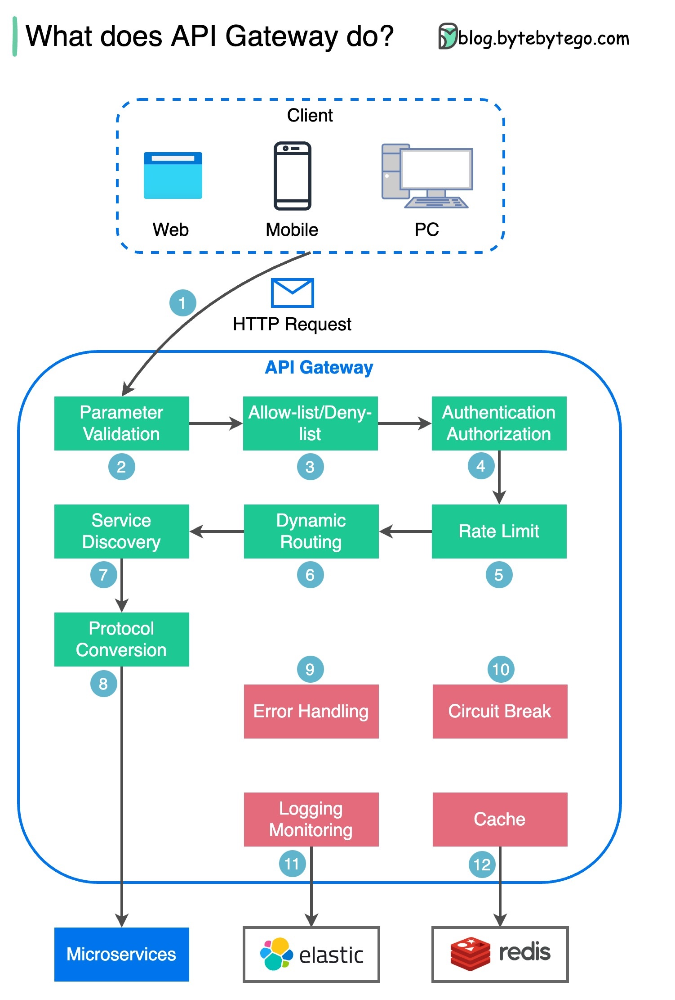
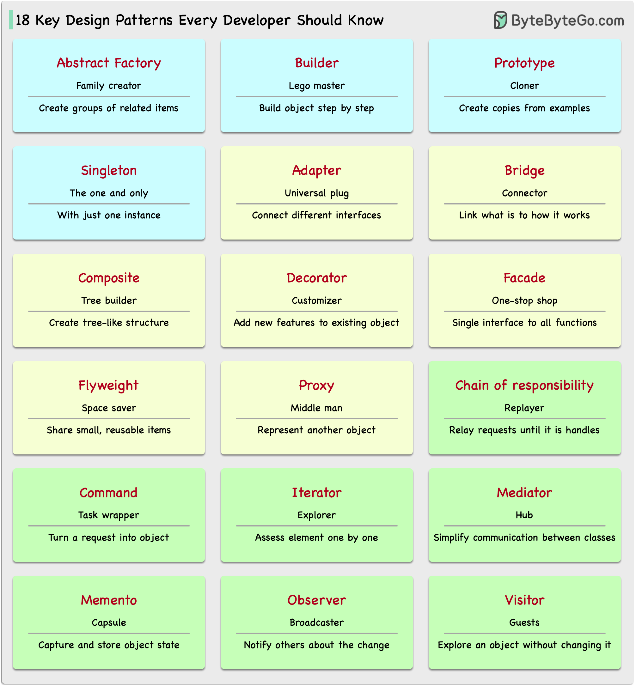

# Thiết Kế Hệ Thống 101

Giải thích các hệ thống phức tạp bằng hình ảnh trực quan và các thuật ngữ đơn giản.

Cho dù bạn đang chuẩn bị cho một cuộc phỏng vấn Thiết kế Hệ thống hay đơn giản là muốn hiểu cách các hệ thống hoạt động bên dưới bề mặt, chúng tôi hy vọng kho lưu trữ này sẽ giúp bạn đạt được điều đó.

# Mục lục

<!-- TOC toc.levels=2 -->

- [Giao thức truyền thông](#giao-thức-truyền-thông)
  - [REST API vs. GraphQL](#rest-api-vs-graphql)
  - [gRPC hoạt động như thế nào?](#grpc-hoạt-động-như-thế-nào)
  - [Webhook là gì?](#webhook-là-gì)
  - [Làm thế nào để cải thiện hiệu suất API?](#làm-thế-nào-để-cải-thiện-hiệu-suất-api)
  - [HTTP 1.0 -> HTTP 1.1 -> HTTP 2.0 -> HTTP 3.0 (QUIC)](#http-10---http-11---http-20---http-30-quic)
  - [SOAP vs REST vs GraphQL vs RPC](#soap-vs-rest-vs-graphql-vs-rpc)
  - [Code First vs. API First](#code-first-vs-api-first)
  - [Mã trạng thái HTTP](#mã-trạng-thái-http)
  - [API gateway làm gì?](#api-gateway-làm-gì)
  - [Làm thế nào để thiết kế API hiệu quả và an toàn?](#làm-thế-nào-để-thiết-kế-api-hiệu-quả-và-an-toàn)
  - [Đóng gói TCP/IP](#đóng-gói-tcpip)
  - [Tại sao Nginx được gọi là proxy "ngược"?](#tại-sao-nginx-được-gọi-là-proxy-ngược)
  - [Các thuật toán cân bằng tải phổ biến là gì?](#các-thuật-toán-cân-bằng-tải-phổ-biến-là-gì)
  - [URL, URI, URN - Bạn có biết sự khác biệt?](#url-uri-urn---bạn-có-biết-sự-khác-biệt)

- [CI/CD](#cicd)
  - [CI/CD Pipeline giải thích bằng thuật ngữ đơn giản](#cicd-pipeline-giải-thích-bằng-thuật-ngữ-đơn-giản)
  - [Tech Stack của Netflix (CI/CD Pipeline)](#tech-stack-của-netflix-cicd-pipeline)

- [Mẫu kiến trúc](#mẫu-kiến-trúc)
  - [MVC, MVP, MVVM, MVVM-C và VIPER](#mvc-mvp-mvvm-mvvm-c-và-viper)
  - [18 Mẫu thiết kế quan trọng mọi nhà phát triển nên biết](#18-mẫu-thiết-kế-quan-trọng-mọi-nhà-phát-triển-nên-biết)

- [Cơ sở dữ liệu](#cơ-sở-dữ-liệu)
  - [Tổng quan về các cơ sở dữ liệu khác nhau trong dịch vụ đám mây](#tổng-quan-về-các-cơ-sở-dữ-liệu-khác-nhau-trong-dịch-vụ-đám-mây)
  - [8 Cấu trúc dữ liệu cung cấp năng lượng cho cơ sở dữ liệu của bạn](#8-cấu-trúc-dữ-liệu-cung-cấp-năng-lượng-cho-cơ-sở-dữ-liệu-của-bạn)
  - [Câu lệnh SQL được thực thi trong cơ sở dữ liệu như thế nào?](#câu-lệnh-sql-được-thực-thi-trong-cơ-sở-dữ-liệu-như-thế-nào)
  - [Định lý CAP](#định-lý-cap)
  - [Các loại bộ nhớ và lưu trữ](#các-loại-bộ-nhớ-và-lưu-trữ)
  - [Trực quan hóa truy vấn SQL](#trực-quan-hóa-truy-vấn-sql)
  - [Ngôn ngữ SQL](#ngôn-ngữ-sql)

- [Bộ nhớ đệm](#bộ-nhớ-đệm)
  - [Dữ liệu được lưu vào bộ nhớ đệm ở mọi nơi](#dữ-liệu-được-lưu-vào-bộ-nhớ-đệm-ở-mọi-nơi)
  - [Tại sao Redis lại nhanh?](#tại-sao-redis-lại-nhanh)
  - [Redis có thể được sử dụng như thế nào?](#redis-có-thể-được-sử-dụng-như-thế-nào)
  - [Các chiến lược lưu trữ đệm hàng đầu](#các-chiến-lược-lưu-trữ-đệm-hàng-đầu)

- [Kiến trúc vi dịch vụ](#kiến-trúc-vi-dịch-vụ)
  - [Một kiến trúc vi dịch vụ điển hình trông như thế nào?](#một-kiến-trúc-vi-dịch-vụ-điển-hình-trông-như-thế-nào)
  - [Các phương pháp hay nhất về vi dịch vụ](#các-phương-pháp-hay-nhất-về-vi-dịch-vụ)
  - [Tech stack nào thường được sử dụng cho vi dịch vụ?](#tech-stack-nào-thường-được-sử-dụng-cho-vi-dịch-vụ)
  - [Tại sao Kafka lại nhanh](#tại-sao-kafka-lại-nhanh)

- [Hệ thống thanh toán](#hệ-thống-thanh-toán)
  - [Làm thế nào để tìm hiểu về hệ thống thanh toán?](#làm-thế-nào-để-tìm-hiểu-về-hệ-thống-thanh-toán)
  - [Tại sao thẻ tín dụng được gọi là "sản phẩm sinh lời nhất trong ngân hàng"? VISA/Mastercard kiếm tiền như thế nào?](#tại-sao-thẻ-tín-dụng-được-gọi-là-sản-phẩm-sinh-lời-nhất-trong-ngân-hàng-visamastercard-kiếm-tiền-như-thế-nào)
  - [VISA hoạt động như thế nào khi chúng ta quẹt thẻ tín dụng tại cửa hàng?](#visa-hoạt-động-như-thế-nào-khi-chúng-ta-quẹt-thẻ-tín-dụng-tại-cửa-hàng)
  - [Hệ thống thanh toán trên thế giới (Phần 1): Giao diện thanh toán thống nhất (UPI) ở Ấn Độ](#hệ-thống-thanh-toán-trên-thế-giới-phần-1-giao-diện-thanh-toán-thống-nhất-upi-ở-ấn-độ)

- [DevOps](#devops)
  - [DevOps vs. SRE vs. Platform Engineering. Sự khác biệt là gì?](#devops-vs-sre-vs-platform-engineering-sự-khác-biệt-là-gì)
  - [k8s (Kubernetes) là gì?](#k8s-kubernetes-là-gì)
  - [Docker vs. Kubernetes. Chúng ta nên sử dụng cái nào?](#docker-vs-kubernetes-chúng-ta-nên-sử-dụng-cái-nào)
  - [Docker hoạt động như thế nào?](#docker-hoạt-động-như-thế-nào)

- [GIT](#git)
  - [Các lệnh Git hoạt động như thế nào](#các-lệnh-git-hoạt-động-như-thế-nào)
  - [Git hoạt động như thế nào?](#git-hoạt-động-như-thế-nào)
  - [Git merge vs. Git rebase](#git-merge-vs-git-rebase)

- [Dịch vụ đám mây](#dịch-vụ-đám-mây)
  - [Tổng quan về các dịch vụ đám mây khác nhau (phiên bản 2023)](#tổng-quan-về-các-dịch-vụ-đám-mây-khác-nhau-phiên-bản-2023)
  - [Cloud native là gì?](#cloud-native-là-gì)

- [Công cụ năng suất cho nhà phát triển](#công-cụ-năng-suất-cho-nhà-phát-triển)
  - [Trực quan hóa tệp JSON](#trực-quan-hóa-tệp-json)
  - [Tự động chuyển đổi mã thành sơ đồ kiến trúc](#tự-động-chuyển-đổi-mã-thành-sơ-đồ-kiến-trúc)

- [Linux](#linux)
  - [Hệ thống tệp Linux được giải thích](#hệ-thống-tệp-linux-được-giải-thích)
  - [18 Lệnh Linux được sử dụng nhiều nhất bạn nên biết](#18-lệnh-linux-được-sử-dụng-nhiều-nhất-bạn-nên-biết)

- [Bảo mật](#bảo-mật)
  - [HTTPS hoạt động như thế nào?](#https-hoạt-động-như-thế-nào)
  - [OAuth 2.0 được giải thích bằng thuật ngữ đơn giản](#oauth-20-được-giải-thích-bằng-thuật-ngữ-đơn-giản)
  - [4 hình thức cơ chế xác thực hàng đầu](#4-hình-thức-cơ-chế-xác-thực-hàng-đầu)
  - [Session, cookie, JWT, token, SSO và OAuth 2.0 - chúng là gì?](#session-cookie-jwt-token-sso-và-oauth-20---chúng-là-gì)
  - [Làm thế nào để lưu trữ mật khẩu an toàn trong cơ sở dữ liệu và xác thực mật khẩu?](#làm-thế-nào-để-lưu-trữ-mật-khẩu-an-toàn-trong-cơ-sở-dữ-liệu-và-xác-thực-mật-khẩu)
  - [Giải thích JSON Web Token (JWT) cho trẻ 10 tuổi](#giải-thích-json-web-token-jwt-cho-trẻ-10-tuổi)
  - [Google Authenticator (hoặc các loại xác thực 2 yếu tố khác) hoạt động như thế nào?](#google-authenticator-hoặc-các-loại-xác-thực-2-yếu-tố-khác-hoạt-động-như-thế-nào)

- [Nghiên cứu tình huống thực tế](#nghiên-cứu-tình-huống-thực-tế)
  - [Tech Stack của Netflix](#tech-stack-của-netflix)
  - [Kiến trúc Twitter 2022](#kiến-trúc-twitter-2022)
  - [Sự phát triển của kiến trúc vi dịch vụ Airbnb trong 15 năm qua](#sự-phát-triển-của-kiến-trúc-vi-dịch-vụ-airbnb-trong-15-năm-qua)
  - [Monorepo vs. Microrepo](#monorepo-vs-microrepo)
  - [Bạn sẽ thiết kế trang web Stack Overflow như thế nào?](#bạn-sẽ-thiết-kế-trang-web-stack-overflow-như-thế-nào)
  - [Tại sao giám sát Amazon Prime Video chuyển từ serverless sang monolithic? Làm thế nào có thể tiết kiệm 90% chi phí?](#tại-sao-giám-sát-amazon-prime-video-chuyển-từ-serverless-sang-monolithic-làm-thế-nào-có-thể-tiết-kiệm-90-chi-phí)
  - [Disney Hotstar ghi nhận 5 tỷ emoji trong một giải đấu như thế nào?](#disney-hotstar-ghi-nhận-5-tỷ-emoji-trong-một-giải-đấu-như-thế-nào)
  - [Discord lưu trữ hàng nghìn tỷ tin nhắn như thế nào](#discord-lưu-trữ-hàng-nghìn-tỷ-tin-nhắn-như-thế-nào)
  - [Phát trực tiếp video hoạt động như thế nào trên YouTube, TikTok live hoặc Twitch?](#phát-trực-tiếp-video-hoạt-động-như-thế-nào-trên-youtube-tiktok-live-hoặc-twitch)

<!-- /TOC -->

## Giao thức truyền thông

Các kiểu kiến trúc định nghĩa cách các thành phần khác nhau của giao diện lập trình ứng dụng (API) tương tác với nhau. Do đó, chúng đảm bảo hiệu quả, độ tin cậy và dễ dàng tích hợp với các hệ thống khác bằng cách cung cấp cách tiếp cận tiêu chuẩn để thiết kế và xây dựng API. Dưới đây là các kiểu được sử dụng phổ biến nhất:

  

- SOAP:

  Trưởng thành, toàn diện, dựa trên XML
  
  Tốt nhất cho các ứng dụng doanh nghiệp

- RESTful:

  Phổ biến, dễ triển khai, phương thức HTTP

  Lý tưởng cho dịch vụ web

- GraphQL:

  Ngôn ngữ truy vấn, yêu cầu dữ liệu cụ thể

  Giảm tải mạng, phản hồi nhanh hơn

- gRPC:

  Hiện đại, hiệu suất cao, Protocol Buffers

  Phù hợp cho kiến trúc vi dịch vụ

- WebSocket:

  Thời gian thực, hai chiều, kết nối liên tục

  Hoàn hảo cho trao đổi dữ liệu độ trễ thấp

- Webhook:

  Hướng sự kiện, callback HTTP, bất đồng bộ

  Thông báo cho hệ thống khi sự kiện xảy ra

[Tiếp tục nội dung chi tiết của từng phần...]

## Giấy phép

Tác phẩm này được cấp phép theo <a href="http://creativecommons.org/licenses/by-nc-nd/4.0/?ref=chooser-v1" target="_blank" rel="license noopener noreferrer" style="display:inline-block;">CC BY-NC-ND 4.0</a>
 

### REST API vs. GraphQL

Khi nói đến thiết kế API, REST và GraphQL đều có những điểm mạnh và điểm yếu riêng.

Sơ đồ dưới đây cho thấy sự so sánh nhanh giữa REST và GraphQL.

  

REST

- Sử dụng các phương thức HTTP tiêu chuẩn như GET, POST, PUT, DELETE cho các thao tác CRUD.
- Hoạt động tốt khi bạn cần giao diện đơn giản, thống nhất giữa các dịch vụ/ứng dụng riêng biệt.
- Các chiến lược bộ nhớ đệm dễ dàng triển khai.
- Nhược điểm là có thể cần nhiều lần gọi để lấy dữ liệu liên quan từ các endpoint riêng biệt.

GraphQL

- Cung cấp một endpoint duy nhất để client truy vấn chính xác dữ liệu họ cần.
- Client chỉ định chính xác các trường cần thiết trong các truy vấn lồng nhau, và server trả về payload được tối ưu hóa chỉ chứa những trường đó.
- Hỗ trợ Mutations để sửa đổi dữ liệu và Subscriptions cho thông báo thời gian thực.
- Tuyệt vời cho việc tổng hợp dữ liệu từ nhiều nguồn và hoạt động tốt với các yêu cầu frontend phát triển nhanh chóng.
- Tuy nhiên, nó chuyển độ phức tạp sang phía client và có thể cho phép các truy vấn lạm dụng nếu không được bảo vệ đúng cách
- Các chiến lược bộ nhớ đệm có thể phức tạp hơn REST.

Lựa chọn tốt nhất giữa REST và GraphQL phụ thuộc vào các yêu cầu cụ thể của ứng dụng và nhóm phát triển. GraphQL phù hợp với nhu cầu frontend phức tạp hoặc thường xuyên thay đổi, trong khi REST phù hợp với các ứng dụng cần hợp đồng đơn giản và nhất quán.

Không có cách tiếp cận API nào là hoàn hảo. Đánh giá cẩn thận các yêu cầu và đánh đổi là quan trọng để chọn phong cách phù hợp. Cả REST và GraphQL đều là lựa chọn hợp lệ để hiển thị dữ liệu và cung cấp năng lượng cho các ứng dụng hiện đại.

### gRPC hoạt động như thế nào?

RPC (Remote Procedure Call) được gọi là "**từ xa**" vì nó cho phép giao tiếp giữa các dịch vụ từ xa khi các dịch vụ được triển khai trên các máy chủ khác nhau trong kiến trúc vi dịch vụ. Từ góc độ người dùng, nó hoạt động giống như một lời gọi hàm cục bộ.

Sơ đồ dưới đây minh họa luồng dữ liệu tổng thể cho **gRPC**.

  

Bước 1: Một cuộc gọi REST được thực hiện từ client. Nội dung yêu cầu thường ở định dạng JSON.

Bước 2 - 4: Dịch vụ đặt hàng (gRPC client) nhận cuộc gọi REST, chuyển đổi nó và thực hiện cuộc gọi RPC đến dịch vụ thanh toán. gRPC mã hóa **client stub** thành định dạng nhị phân và gửi nó đến lớp truyền tải cấp thấp.

Bước 5: gRPC gửi các gói qua mạng thông qua HTTP2. Do mã hóa nhị phân và tối ưu hóa mạng, gRPC được cho là nhanh hơn JSON 5 lần.

Bước 6 - 8: Dịch vụ thanh toán (gRPC server) nhận các gói từ mạng, giải mã chúng và gọi ứng dụng server.

Bước 9 - 11: Kết quả được trả về từ ứng dụng server, được mã hóa và gửi đến lớp truyền tải.

Bước 12 - 14: Dịch vụ đặt hàng nhận các gói, giải mã chúng và gửi kết quả đến ứng dụng client.

### Webhook là gì?

Sơ đồ dưới đây cho thấy sự so sánh giữa polling và Webhook.

  

Giả sử chúng ta vận hành một trang web thương mại điện tử. Các client gửi đơn đặt hàng đến dịch vụ đặt hàng thông qua API gateway, sau đó chuyển đến dịch vụ thanh toán để thực hiện giao dịch. Dịch vụ thanh toán sau đó nói chuyện với nhà cung cấp dịch vụ thanh toán bên ngoài (PSP) để hoàn tất giao dịch.

Có hai cách để xử lý giao tiếp với PSP bên ngoài.

**1. Short polling**

Sau khi gửi yêu cầu thanh toán đến PSP, dịch vụ thanh toán liên tục hỏi PSP về trạng thái thanh toán. Sau một vài vòng, PSP cuối cùng trả về trạng thái.

Short polling có hai nhược điểm:
* Việc liên tục polling trạng thái yêu cầu tài nguyên từ dịch vụ thanh toán.
* Dịch vụ bên ngoài giao tiếp trực tiếp với dịch vụ thanh toán, tạo ra các lỗ hổng bảo mật.

**2. Webhook**

Chúng ta có thể đăng ký một webhook với dịch vụ bên ngoài. Điều này có nghĩa là: gọi lại cho tôi tại một URL nhất định khi bạn có cập nhật về yêu cầu. Khi PSP đã hoàn tất xử lý, nó sẽ gọi yêu cầu HTTP để cập nhật trạng thái thanh toán.

Theo cách này, mô hình lập trình được thay đổi và dịch vụ thanh toán không cần lãng phí tài nguyên để polling trạng thái thanh toán nữa.

Điều gì xảy ra nếu PSP không bao giờ gọi lại? Chúng ta có thể thiết lập một công việc quản lý để kiểm tra trạng thái thanh toán mỗi giờ.

Webhook thường được gọi là API ngược hoặc API đẩy vì server gửi yêu cầu HTTP đến client. Chúng ta cần chú ý đến 3 điều khi sử dụng webhook:

1. Chúng ta cần thiết kế một API phù hợp cho dịch vụ bên ngoài gọi.
2. Chúng ta cần thiết lập các quy tắc phù hợp trong API gateway vì lý do bảo mật.
3. Chúng ta cần đăng ký URL chính xác tại dịch vụ bên ngoài.

### Làm thế nào để cải thiện hiệu suất API?

Sơ đồ dưới đây cho thấy 5 thủ thuật phổ biến để cải thiện hiệu suất API.

  

Phân trang

Đây là một tối ưu hóa phổ biến khi kích thước của kết quả lớn. Các kết quả được truyền về client để cải thiện khả năng phản hồi của dịch vụ.

Ghi nhật ký bất đồng bộ

Ghi nhật ký đồng bộ xử lý với đĩa cho mỗi lần gọi và có thể làm chậm hệ thống. Ghi nhật ký bất đồng bộ gửi nhật ký đến một bộ đệm không khóa trước và trả về ngay lập tức. Nhật ký sẽ được đẩy xuống đĩa định kỳ. Điều này giảm đáng kể chi phí I/O.

Bộ nhớ đệm

Chúng ta có thể lưu trữ dữ liệu được truy cập thường xuyên vào bộ nhớ đệm. Client có thể truy vấn bộ nhớ đệm trước thay vì truy cập trực tiếp cơ sở dữ liệu. Nếu có cache miss, client có thể truy vấn từ cơ sở dữ liệu. Bộ nhớ đệm như Redis lưu trữ dữ liệu trong bộ nhớ, vì vậy việc truy cập dữ liệu nhanh hơn nhiều so với cơ sở dữ liệu.

Nén payload

Các yêu cầu và phản hồi có thể được nén bằng gzip v.v. để kích thước dữ liệu được truyền nhỏ hơn nhiều. Điều này tăng tốc tải lên và tải xuống.

Connection Pool

Khi truy cập tài nguyên, chúng ta thường cần tải dữ liệu từ cơ sở dữ liệu. Việc mở và đóng kết nối db tạo thêm chi phí đáng kể. Vì vậy chúng ta nên kết nối với db thông qua một pool các kết nối mở. Connection pool chịu trách nhiệm quản lý vòng đời kết nối.

### HTTP 1.0 -> HTTP 1.1 -> HTTP 2.0 -> HTTP 3.0 (QUIC)

Mỗi thế hệ HTTP giải quyết vấn đề gì?

Sơ đồ dưới đây minh họa các tính năng chính.

  

- HTTP 1.0 được hoàn thiện và tài liệu hóa đầy đủ vào năm 1996. Mỗi yêu cầu đến cùng một server yêu cầu một kết nối TCP riêng biệt.

- HTTP 1.1 được xuất bản vào năm 1997. Một kết nối TCP có thể được để mở để tái sử dụng (kết nối liên tục), nhưng nó không giải quyết vấn đề HOL (head-of-line) blocking.

  HOL blocking - khi số lượng yêu cầu song song cho phép trong trình duyệt được sử dụng hết, các yêu cầu tiếp theo cần đợi các yêu cầu trước hoàn thành.

- HTTP 2.0 được xuất bản vào năm 2015. Nó giải quyết vấn đề HOL thông qua multiplexing yêu cầu, loại bỏ HOL blocking ở tầng ứng dụng, nhưng HOL vẫn tồn tại ở tầng vận chuyển (TCP).

  Như bạn có thể thấy trong sơ đồ, HTTP 2.0 giới thiệu khái niệm "streams" HTTP: một trừu tượng cho phép multiplexing các trao đổi HTTP khác nhau trên cùng một kết nối TCP. Mỗi stream không cần phải được gửi theo thứ tự.

- HTTP 3.0 bản nháp đầu tiên được xuất bản vào năm 2020. Đây là phiên bản kế nhiệm được đề xuất cho HTTP 2.0. Nó sử dụng QUIC thay vì TCP cho giao thức vận chuyển cơ bản, do đó loại bỏ HOL blocking trong tầng vận chuyển.

QUIC dựa trên UDP. Nó giới thiệu streams như các thành phần hạng nhất ở tầng vận chuyển. Các QUIC stream chia sẻ cùng một kết nối QUIC, vì vậy không cần thêm bắt tay và khởi động chậm để tạo stream mới, nhưng các QUIC stream được gửi độc lập sao cho trong hầu hết các trường hợp mất gói tin ảnh hưởng đến một stream không ảnh hưởng đến các stream khác.

[Tiếp tục nội dung chi tiết của từng phần...] 

### SOAP vs REST vs GraphQL vs RPC

Sơ đồ dưới đây minh họa dòng thời gian API và so sánh các kiểu API.

Theo thời gian, các kiểu kiến trúc API khác nhau được phát hành. Mỗi kiểu có các mẫu riêng để chuẩn hóa việc trao đổi dữ liệu.

Bạn có thể kiểm tra các trường hợp sử dụng của từng kiểu trong sơ đồ.

  

### Code First vs. API First

Sơ đồ dưới đây cho thấy sự khác biệt giữa phát triển code-first và API-first. Tại sao chúng ta nên xem xét thiết kế API first?

  

- Vi dịch vụ làm tăng độ phức tạp của hệ thống và chúng ta có các dịch vụ riêng biệt để phục vụ các chức năng khác nhau của hệ thống. Mặc dù kiến trúc này tạo điều kiện cho việc tách rời và phân chia nhiệm vụ, chúng ta cần xử lý các giao tiếp khác nhau giữa các dịch vụ.

Tốt hơn là nên suy nghĩ về độ phức tạp của hệ thống trước khi viết mã và xác định cẩn thận ranh giới của các dịch vụ.

- Các nhóm chức năng riêng biệt cần nói cùng một ngôn ngữ và các nhóm chức năng chuyên biệt chỉ chịu trách nhiệm cho các thành phần và dịch vụ của riêng họ. Khuyến nghị rằng tổ chức nói cùng một ngôn ngữ thông qua thiết kế API.

Chúng ta có thể giả lập các yêu cầu và phản hồi để xác thực thiết kế API trước khi viết mã.

- Cải thiện chất lượng phần mềm và năng suất của nhà phát triển. Vì chúng ta đã giải quyết hầu hết các điểm không chắc chắn khi dự án bắt đầu, quá trình phát triển tổng thể suôn sẻ hơn và chất lượng phần mềm được cải thiện đáng kể.

Các nhà phát triển cũng hài lòng về quy trình vì họ có thể tập trung vào phát triển chức năng thay vì thương lượng về những thay đổi đột ngột.

Khả năng có những bất ngờ vào cuối vòng đời dự án được giảm thiểu.

Vì chúng ta đã thiết kế API trước, các bài kiểm tra có thể được thiết kế trong khi mã đang được phát triển. Theo một cách nào đó, chúng ta cũng có TDD (Thiết kế hướng kiểm thử) khi sử dụng phát triển API first.

### Mã trạng thái HTTP

  

Các mã phản hồi cho HTTP được chia thành năm loại:

Thông tin (100-199)
Thành công (200-299)
Chuyển hướng (300-399)
Lỗi Client (400-499)
Lỗi Server (500-599)

### API gateway làm gì?

Sơ đồ dưới đây cho thấy chi tiết.

  

Bước 1 - Client gửi yêu cầu HTTP đến API gateway.

Bước 2 - API gateway phân tích và xác thực các thuộc tính trong yêu cầu HTTP.

Bước 3 - API gateway thực hiện kiểm tra danh sách cho phép/từ chối.

Bước 4 - API gateway nói chuyện với nhà cung cấp danh tính để xác thực và ủy quyền.

Bước 5 - Các quy tắc giới hạn tốc độ được áp dụng cho yêu cầu. Nếu vượt quá giới hạn, yêu cầu bị từ chối.

Bước 6 và 7 - Bây giờ yêu cầu đã vượt qua các kiểm tra cơ bản, API gateway tìm dịch vụ liên quan để định tuyến bằng cách khớp đường dẫn.

Bước 8 - API gateway chuyển đổi yêu cầu thành giao thức thích hợp và gửi nó đến các vi dịch vụ backend.

Bước 9-12: API gateway có thể xử lý lỗi đúng cách và xử lý các lỗi nếu lỗi mất nhiều thời gian để khôi phục (ngắt mạch). Nó cũng có thể tận dụng stack ELK (Elastic-Logstash-Kibana) để ghi nhật ký và giám sát. Đôi khi chúng ta lưu trữ dữ liệu trong bộ nhớ đệm trong API gateway.

### Làm thế nào để thiết kế API hiệu quả và an toàn?

Sơ đồ dưới đây cho thấy các thiết kế API điển hình với ví dụ về giỏ hàng.

  

Lưu ý rằng thiết kế API không chỉ là thiết kế đường dẫn URL. Hầu hết thời gian, chúng ta cần chọn tên tài nguyên, định danh và mẫu đường dẫn phù hợp. Việc thiết kế các trường header HTTP phù hợp hoặc thiết kế các quy tắc giới hạn tốc độ hiệu quả trong API gateway cũng quan trọng không kém.

### Đóng gói TCP/IP

Dữ liệu được gửi qua mạng như thế nào? Tại sao chúng ta cần nhiều lớp trong mô hình OSI?

Sơ đồ dưới đây cho thấy cách dữ liệu được đóng gói và giải nén khi truyền qua mạng.

  

Bước 1: Khi Thiết bị A gửi dữ liệu đến Thiết bị B qua mạng thông qua giao thức HTTP, đầu tiên nó được thêm header HTTP ở tầng ứng dụng.

Bước 2: Sau đó header TCP hoặc UDP được thêm vào dữ liệu. Nó được đóng gói thành các phân đoạn TCP ở tầng vận chuyển. Header chứa cổng nguồn, cổng đích và số thứ tự.

Bước 3: Các phân đoạn sau đó được đóng gói với header IP ở tầng mạng. Header IP chứa địa chỉ IP nguồn/đích.

Bước 4: Datagram IP được thêm header MAC ở tầng liên kết dữ liệu, với địa chỉ MAC nguồn/đích.

Bước 5: Các khung được đóng gói được gửi đến tầng vật lý và gửi qua mạng dưới dạng bit nhị phân.

Bước 6-10: Khi Thiết bị B nhận các bit từ mạng, nó thực hiện quá trình giải nén, là quá trình xử lý ngược lại của quá trình đóng gói. Các header được loại bỏ từng lớp một, và cuối cùng, Thiết bị B có thể đọc dữ liệu.

Chúng ta cần các lớp trong mô hình mạng vì mỗi lớp tập trung vào trách nhiệm riêng của nó. Mỗi lớp có thể dựa vào các header để xử lý hướng dẫn và không cần biết ý nghĩa của dữ liệu từ lớp trước.

### Tại sao Nginx được gọi là proxy "ngược"?

Sơ đồ dưới đây cho thấy sự khác biệt giữa proxy chuyển tiếp và proxy ngược.

  

Proxy chuyển tiếp là một server nằm giữa các thiết bị người dùng và internet.

Proxy chuyển tiếp thường được sử dụng cho:

1. Bảo vệ clients
2. Vượt qua các hạn chế duyệt web
3. Chặn truy cập vào nội dung nhất định

Proxy ngược là một server chấp nhận yêu cầu từ client, chuyển tiếp yêu cầu đến các web server và trả về kết quả cho client như thể server proxy đã xử lý yêu cầu.

Proxy ngược tốt cho:

1. Bảo vệ servers
2. Cân bằng tải
3. Lưu trữ đệm nội dung tĩnh
4. Mã hóa và giải mã giao tiếp SSL

### Các thuật toán cân bằng tải phổ biến là gì?

Sơ đồ dưới đây cho thấy 6 thuật toán phổ biến.

  

- Thuật toán tĩnh

1. Round robin

    Các yêu cầu của client được gửi đến các instance dịch vụ khác nhau theo thứ tự tuần tự. Các dịch vụ thường được yêu cầu phải không có trạng thái.

2. Sticky round-robin

    Đây là cải tiến của thuật toán round-robin. Nếu yêu cầu đầu tiên của Alice đi đến dịch vụ A, các yêu cầu tiếp theo cũng sẽ đi đến dịch vụ A.

3. Weighted round-robin

    Admin có thể chỉ định trọng số cho mỗi dịch vụ. Những dịch vụ có trọng số cao hơn xử lý nhiều yêu cầu hơn các dịch vụ khác.

4. Hash

    Thuật toán này áp dụng một hàm băm trên IP hoặc URL của các yêu cầu đến. Các yêu cầu được định tuyến đến các instance liên quan dựa trên kết quả của hàm băm.

- Thuật toán động

5. Least connections

    Một yêu cầu mới được gửi đến instance dịch vụ có ít kết nối đồng thời nhất.

6. Least response time

    Một yêu cầu mới được gửi đến instance dịch vụ có thời gian phản hồi nhanh nhất.

### URL, URI, URN - Bạn có biết sự khác biệt?

Sơ đồ dưới đây cho thấy sự so sánh giữa URL, URI và URN.

  

- URI

URI là viết tắt của Uniform Resource Identifier. Nó xác định một tài nguyên logic hoặc vật lý trên web. URL và URN là các kiểu con của URI. URL định vị một tài nguyên, trong khi URN đặt tên một tài nguyên.

URI được cấu thành từ các phần sau:
scheme:[//authority]path[?query][#fragment]

- URL

URL là viết tắt của Uniform Resource Locator, khái niệm chính của HTTP. Đó là địa chỉ của một tài nguyên duy nhất trên web. Nó có thể được sử dụng với các giao thức khác như FTP và JDBC.

- URN

URN là viết tắt của Uniform Resource Name. Nó sử dụng scheme urn. URN không thể được sử dụng để định vị một tài nguyên. Một ví dụ đơn giản được đưa ra trong sơ đồ bao gồm một namespace và một chuỗi namespace cụ thể.

Nếu bạn muốn tìm hiểu thêm chi tiết về chủ đề này, tôi khuyên bạn nên xem [làm rõ của W3C](https://www.w3.org/TR/uri-clarification/). 

## CI/CD

### CI/CD Pipeline giải thích bằng thuật ngữ đơn giản

  

Phần 1 - SDLC với CI/CD

Vòng đời phát triển phần mềm (SDLC) bao gồm một số giai đoạn chính: phát triển, kiểm thử, triển khai và bảo trì. CI/CD tự động hóa và tích hợp các giai đoạn này để cho phép phát hành nhanh hơn và đáng tin cậy hơn.

Khi mã được đẩy lên kho lưu trữ git, nó kích hoạt quy trình xây dựng và kiểm thử tự động. Các trường hợp kiểm thử end-to-end (e2e) được chạy để xác thực mã. Nếu kiểm thử đạt, mã có thể được tự động triển khai lên môi trường staging/production. Nếu phát hiện vấn đề, mã được gửi trở lại phát triển để sửa lỗi. Việc tự động hóa này cung cấp phản hồi nhanh cho nhà phát triển và giảm nguy cơ lỗi trong production.

Phần 2 - Sự khác biệt giữa CI và CD

Tích hợp liên tục (CI) tự động hóa quy trình xây dựng, kiểm thử và hợp nhất. Nó chạy kiểm thử bất cứ khi nào mã được commit để phát hiện sớm các vấn đề tích hợp. Điều này khuyến khích commit mã thường xuyên và phản hồi nhanh.

Triển khai liên tục (CD) tự động hóa các quy trình phát hành như thay đổi cơ sở hạ tầng và triển khai. Nó đảm bảo phần mềm có thể được phát hành một cách đáng tin cậy bất cứ lúc nào thông qua quy trình làm việc tự động. CD cũng có thể tự động hóa các bước kiểm thử thủ công và phê duyệt cần thiết trước khi triển khai production.

Phần 3 - CI/CD Pipeline

Một CI/CD pipeline điển hình có một số giai đoạn được kết nối:
- Nhà phát triển commit thay đổi mã vào source control
- CI server phát hiện thay đổi và kích hoạt việc xây dựng
- Mã được biên dịch và kiểm thử (unit test, integration test)
- Kết quả kiểm thử được báo cáo cho nhà phát triển
- Khi thành công, các artifact được triển khai lên môi trường staging
- Có thể thực hiện thêm kiểm thử trên staging trước khi phát hành
- Hệ thống CD triển khai các thay đổi đã được phê duyệt lên production

### Tech Stack của Netflix (CI/CD Pipeline)

  

Lập kế hoạch: Netflix Engineering sử dụng JIRA để lập kế hoạch và Confluence để tài liệu hóa.

Lập trình: Java là ngôn ngữ lập trình chính cho dịch vụ backend, trong khi các ngôn ngữ khác được sử dụng cho các trường hợp sử dụng khác nhau.

Xây dựng: Gradle chủ yếu được sử dụng để xây dựng, và các plugin Gradle được xây dựng để hỗ trợ các trường hợp sử dụng khác nhau.

Đóng gói: Gói và các phụ thuộc được đóng gói vào một Amazon Machine Image (AMI) để phát hành.

Kiểm thử: Kiểm thử nhấn mạnh vào văn hóa production tập trung vào việc xây dựng các công cụ chaos.

Triển khai: Netflix sử dụng Spinnaker tự xây dựng cho triển khai canary rollout.

Giám sát: Các chỉ số giám sát được tập trung trong Atlas, và Kayenta được sử dụng để phát hiện bất thường.

Báo cáo sự cố: Các sự cố được phân phối theo mức độ ưu tiên, và PagerDuty được sử dụng để xử lý sự cố.

## Mẫu kiến trúc

### MVC, MVP, MVVM, MVVM-C và VIPER

Các mẫu kiến trúc này là một trong những mẫu được sử dụng phổ biến nhất trong phát triển ứng dụng, cho dù là trên nền tảng iOS hay Android. Các nhà phát triển đã giới thiệu chúng để khắc phục những hạn chế của các mẫu trước đó. Vậy chúng khác nhau như thế nào?

  

- MVC, mẫu cũ nhất, có từ gần 50 năm trước
- Mọi mẫu đều có một "view" (V) chịu trách nhiệm hiển thị nội dung và nhận đầu vào của người dùng
- Hầu hết các mẫu bao gồm một "model" (M) để quản lý dữ liệu kinh doanh
- "Controller", "presenter" và "view-model" là các bộ chuyển đổi trung gian giữa view và model ("entity" trong mẫu VIPER)

### 18 Mẫu thiết kế quan trọng mọi nhà phát triển nên biết

Các mẫu là các giải pháp có thể tái sử dụng cho các vấn đề thiết kế phổ biến, dẫn đến quy trình phát triển suôn sẻ và hiệu quả hơn. Chúng đóng vai trò như bản thiết kế để xây dựng cấu trúc phần mềm tốt hơn. Đây là một số mẫu phổ biến nhất:

  

- Abstract Factory: Người tạo họ - Tạo các nhóm mục liên quan.
- Builder: Bậc thầy Lego - Xây dựng đối tượng từng bước một, giữ tách biệt việc tạo và hình thức.
- Prototype: Người tạo bản sao - Tạo bản sao của các ví dụ đã chuẩn bị đầy đủ.
- Singleton: Duy nhất - Một lớp đặc biệt chỉ có một thể hiện.
- Adapter: Phích cắm đa năng - Kết nối các thứ có giao diện khác nhau.
- Bridge: Kết nối chức năng - Liên kết cách một đối tượng hoạt động với những gì nó làm.
- Composite: Người xây dựng cây - Tạo cấu trúc dạng cây của các phần đơn giản và phức tạp.
- Decorator: Người tùy chỉnh - Thêm tính năng cho đối tượng mà không thay đổi cốt lõi.
- Facade: Cửa hàng một điểm dừng - Đại diện cho toàn bộ hệ thống bằng một giao diện đơn giản.
- Flyweight: Người tiết kiệm không gian - Chia sẻ các mục nhỏ, có thể tái sử dụng một cách hiệu quả.
- Proxy: Diễn viên thay thế - Đại diện cho một đối tượng khác, kiểm soát truy cập hoặc hành động.
- Chain of Responsibility: Chuyển tiếp yêu cầu - Chuyển yêu cầu qua chuỗi đối tượng cho đến khi được xử lý.
- Command: Bọc tác vụ - Chuyển yêu cầu thành đối tượng, sẵn sàng cho hành động.
- Iterator: Người khám phá bộ sưu tập - Truy cập các phần tử trong bộ sưu tập từng cái một.
- Mediator: Trung tâm giao tiếp - Đơn giản hóa tương tác giữa các lớp khác nhau.
- Memento: Viên nang thời gian - Ghi lại và khôi phục trạng thái của đối tượng.
- Observer: Người phát tin tức - Thông báo cho các lớp về thay đổi trong các đối tượng khác.
- Visitor: Khách có kỹ năng - Thêm thao tác mới cho một lớp mà không thay đổi nó.

[Tiếp tục nội dung chi tiết của từng phần...] 

## Cơ sở dữ liệu

### Tổng quan về các cơ sở dữ liệu khác nhau trong dịch vụ đám mây

  

Chọn cơ sở dữ liệu phù hợp cho dự án của bạn là một nhiệm vụ phức tạp. Nhiều tùy chọn cơ sở dữ liệu, mỗi loại phù hợp với các trường hợp sử dụng riêng biệt, có thể nhanh chóng dẫn đến mệt mỏi khi ra quyết định.

Chúng tôi hy vọng bảng tổng quan này cung cấp hướng dẫn cấp cao để xác định dịch vụ phù hợp phù hợp với nhu cầu dự án của bạn và tránh các vấn đề tiềm ẩn.

Lưu ý: Google có tài liệu hạn chế về các trường hợp sử dụng cơ sở dữ liệu của họ. Mặc dù chúng tôi đã cố gắng hết sức để xem xét những gì có sẵn và đưa ra lựa chọn tốt nhất, một số mục có thể cần chính xác hơn.

### 8 Cấu trúc dữ liệu cung cấp năng lượng cho cơ sở dữ liệu của bạn

Câu trả lời sẽ thay đổi tùy thuộc vào trường hợp sử dụng của bạn. Dữ liệu có thể được lập chỉ mục trong bộ nhớ hoặc trên đĩa. Tương tự, định dạng dữ liệu khác nhau, chẳng hạn như số, chuỗi, tọa độ địa lý, v.v. Hệ thống có thể nặng về ghi hoặc nặng về đọc. Tất cả các yếu tố này ảnh hưởng đến lựa chọn định dạng chỉ mục cơ sở dữ liệu của bạn.

  

Sau đây là một số cấu trúc dữ liệu phổ biến nhất được sử dụng để lập chỉ mục dữ liệu:

- Skiplist: một loại chỉ mục trong bộ nhớ phổ biến. Được sử dụng trong Redis
- Hash index: một triển khai phổ biến của cấu trúc dữ liệu "Map" (hoặc "Collection")
- SSTable: triển khai "Map" bất biến trên đĩa
- LSM tree: Skiplist + SSTable. Thông lượng ghi cao
- B-tree: giải pháp dựa trên đĩa. Hiệu suất đọc/ghi nhất quán
- Inverted index: được sử dụng để lập chỉ mục tài liệu. Được sử dụng trong Lucene
- Suffix tree: để tìm kiếm mẫu chuỗi
- R-tree: tìm kiếm đa chiều, chẳng hạn như tìm láng giềng gần nhất

### Câu lệnh SQL được thực thi trong cơ sở dữ liệu như thế nào?

Sơ đồ dưới đây cho thấy quy trình. Lưu ý rằng kiến trúc cho các cơ sở dữ liệu khác nhau là khác nhau, sơ đồ minh họa một số thiết kế phổ biến.

  

Bước 1 - Một câu lệnh SQL được gửi đến cơ sở dữ liệu thông qua giao thức lớp truyền tải (ví dụ: TCP).

Bước 2 - Câu lệnh SQL được gửi đến trình phân tích lệnh, nơi nó trải qua phân tích cú pháp và ngữ nghĩa, và một cây truy vấn được tạo ra sau đó.

Bước 3 - Cây truy vấn được gửi đến bộ tối ưu hóa. Bộ tối ưu hóa tạo một kế hoạch thực thi.

Bước 4 - Kế hoạch thực thi được gửi đến trình thực thi. Trình thực thi truy xuất dữ liệu từ việc thực thi.

Bước 5 - Các phương thức truy cập cung cấp logic truy xuất dữ liệu cần thiết cho việc thực thi, truy xuất dữ liệu từ công cụ lưu trữ.

Bước 6 - Các phương thức truy cập quyết định x

## Bộ nhớ đệm

### Dữ liệu được lưu vào bộ nhớ đệm ở mọi nơi

Sơ đồ này minh họa nơi chúng ta lưu trữ dữ liệu trong bộ nhớ đệm trong một kiến trúc điển hình.

  

Có **nhiều lớp** dọc theo luồng.

1. Ứng dụng client: Các phản hồi HTTP có thể được lưu trong bộ nhớ đệm của trình duyệt. Chúng ta yêu cầu dữ liệu qua HTTP lần đầu tiên, và nó được trả về với chính sách hết hạn trong header HTTP; chúng ta yêu cầu dữ liệu lại, và ứng dụng client cố gắng truy xuất dữ liệu từ bộ nhớ đệm trình duyệt trước.

2. CDN: CDN lưu trữ các tài nguyên web tĩnh. Các client có thể truy xuất dữ liệu từ một node CDN gần đó.

3. Load Balancer: Load Balancer cũng có thể lưu trữ tài nguyên.

4. Cơ sở hạ tầng nhắn tin: Message broker lưu trữ tin nhắn trên đĩa trước, sau đó người tiêu dùng truy xuất chúng theo tốc độ của riêng họ. Tùy thuộc vào chính sách lưu giữ, dữ liệu được lưu trong cụm Kafka trong một khoảng thời gian.

5. Dịch vụ: Có nhiều lớp bộ nhớ đệm trong một dịch vụ. Nếu dữ liệu không được lưu trong bộ nhớ đệm CPU, dịch vụ sẽ cố gắng truy xuất dữ liệu từ bộ nhớ. Đôi khi dịch vụ có bộ nhớ đệm cấp hai để lưu trữ dữ liệu trên đĩa.

6. Bộ nhớ